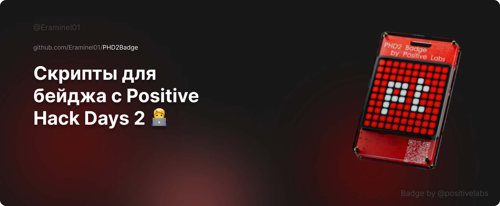

# PHD2Badge



Этот репозиторий содержит скрипты для работы с электронным бейджем PHD2, оснащенным RGB дисплеем 10x10 и основанным на ESP32. Его можно было получить на фестивале Positive Hack Days 2.

## Содержимое репозитория

- **gradient.py**: Скрипт для генерации и отправки градиентных изображений на бейдж. Градиент динамически изменяется и циклически отправляется на дисплей.
- **bad_apple.py**: Скрипт для воспроизведения видео "Bad Apple" на дисплее бейджа. Видео синхронизируется с аудиотреком.
- **snake.py**: Игра "Змейка" для бейджа. Управляйте змейкой с клавиатуры и наблюдайте за игрой на дисплее бейджа.
- **capture_window.py**: Скрипт для захвата окна на вашем компьютере и отображения его содержимого на дисплее бейджа.

## Подключение к бейджу

Для работы со скриптами необходимо подключиться к бейджу по Wi-Fi. Убедитесь, что ваш бейдж подключен и доступен по домену, указанному в скриптах (по умолчанию `http://badge.phd2/`).

## Инструкции по использованию

1. Клонируйте репозиторий:
    ```bash
    git clone https://github.com/Eraminel01/PHD2Badge.git
    ```
2. Установите необходимые зависимости:
    ```bash
    pip install -r requirements.txt
    ```
3. Запустите скрипт, который хотите использовать:
    ```bash
    python gradient.py
    ```

## Пример использования

### gradient.py
Запустите скрипт, чтобы увидеть динамический градиент на вашем бейдже.
```bash
python gradient.py
```
Пример использования:
1. Запустите скрипт.
2. Введите количество шагов в градиенте (или оставьте значение по умолчанию).
3. Введите задержку между кадрами в секундах (или оставьте значение по умолчанию).

### bad_apple.py
Запустите скрипт, чтобы воспроизвести видео "Bad Apple" на дисплее бейджа.
```bash
python bad_apple.py
```
Пример использования:
1. Убедитесь, что файл `bad_apple.mp4` находится в одной директории со скриптом.
2. Запустите скрипт.
3. Ссылка на демонстрацию "Bad Apple":
[Демонстрация Bad Apple](https://www.youtube.com/watch?v=YREEqCkYd-0?si=kE5fvij1WsPg8fkl)

### snake.py
Запустите скрипт и управляйте змейкой с помощью клавиш на клавиатуре.
```bash
python snake.py
```
Пример использования:
1. Запустите скрипт.
2. Используйте клавиши стрелок на клавиатуре для управления змейкой.
3. Просто играйте, я надеюсь, вы знаете как? :)

### capture_window.py
Введите название окна, которое хотите захватить, и наблюдайте за его содержимым на дисплее бейджа.
```bash
python capture_window.py
```
Пример использования:
1. Запустите скрипт.
2. Введите название окна, которое вы хотите захватить.
3. Содержимое выбранного окна будет отображаться на дисплее вашего бейджа.
